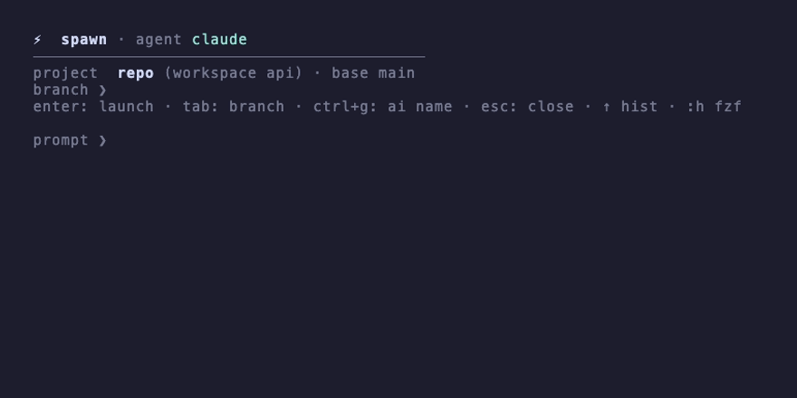

# herdr-spawn

Lancer un agent de code avec un prompt, depuis un popup
[herdr](https://herdr.dev) ou en CLI. Par défaut, chaque agent reçoit son
propre worktree git + workspace herdr (un agent par branche, isolé du
répertoire de travail) ; `--here` est l'opt-out explicite.

*English documentation: [README.md](README.md).*



## Installation

```bash
herdr plugin install JLighter/herdr-spawn
```

Ou pour développer en local :

```bash
git clone https://github.com/JLighter/herdr-spawn
herdr plugin link ./herdr-spawn
```

Binding des popups dans `~/.config/herdr/config.toml` :

```toml
[[keys.command]]
key = "prefix+enter"
type = "plugin_action"
command = "herdr-spawn.open"
description = "lancer un agent (worktree + prompt)"

# optionnel : la récolte (spawn done)
[[keys.command]]
key = "prefix+shift+e"
type = "plugin_action"
command = "herdr-spawn.done"
description = "nettoyer les worktrees d'agents"
```

CLI optionnelle : lier `spawn.sh` dans le PATH, p. ex.
`ln -s /path/to/herdr-spawn/spawn.sh ~/.local/bin/spawn`.

## Usage

**Popup** (`prefix+enter`) — affiche le projet et la branche du pane
actif, lit le prompt, puis lance l'agent sans voler le focus :

- les noms de branches suivent le **format conventional-commit**
  `<type>/<slug>` (feat, fix, chore, docs, refactor…) — le type est
  déduit de la formulation du prompt, ou choisi par le LLM avec
  `slug_command`
- le nom de branche vit **dans le header** et se met à jour en direct
  pendant la frappe du prompt
- `tab` saute sur la ligne branche pour éditer le nom soi-même (elle
  cesse de suivre le prompt dès qu'on y touche ; la vider la rend au
  générateur)
- `ctrl+g` demande un nom à `slug_command` (LLM), **à la demande**
- `entrée` lance (depuis l'un ou l'autre champ), prompt vide ou `esc`
  ferme, `ctrl+c`/`ctrl+d` annulent
- `↑` parcourt l'historique persistant des prompts, `:h` y pioche avec fzf
- hors dépôt git, l'agent s'ouvre en split `--here` au lieu d'un worktree

**CLI** :

```bash
spawn "corrige le bug de pagination"  # worktree + workspace + agent
spawn -H "question rapide"            # split dans le workspace courant
spawn -k opencode -b agent/ma-tache "…"
spawn done                            # lister/nettoyer les worktrees
```

**Récolte** (`spawn done`, ou l'action `herdr-spawn.done`) — liste les
worktrees d'agents du dépôt avec leur état (`[merged]`, `[empty]`,
`[changes]`, `[+N commits]`, `[agent working]`…), sélection multiple
fzf, confirmation, puis retrait worktree + branche. `--list` affiche
l'état seulement.

## Noms de branches par LLM (optionnel)

`slug_command` dans la config fait nommer les branches par un LLM
(local) : la commande reçoit une instruction prête + le prompt de la
tâche sur stdin et imprime un nom sur stdout (re-slugifié par sécurité).
Dans le popup elle tourne **à la demande** : `ctrl+g` lance la
génération, le nom arrive en asynchrone (le slug basique reste affiché
entre-temps) ; un lancement avec une génération en cours attend jusqu'à
`slug_wait` secondes. `slug_warmup` précharge le modèle à
l'ouverture du popup.

```sh
slug_command='ollama run gemma3:4b'
slug_warmup='curl -s http://localhost:11434/api/generate -d "{\"model\":\"gemma3:4b\",\"keep_alive\":\"30m\"}"'
```

## Configuration

`herdr plugin config-dir herdr-spawn` imprime le répertoire de config ;
un fichier `config` commenté y est créé au premier lancement : `kind`
(claude/opencode/…), `branch_types`, `branch_type_default`, `focus`, `here_direction`, `base`,
`history_size`. Les dimensions des popups se règlent dans
`herdr-plugin.toml` (`[[panes]]`, `width`/`height`).

L'historique des prompts vit dans le state dir du plugin
(`~/.local/state/herdr/plugins/herdr-spawn/history`).

## Notes de robustesse

- Si le lancement échoue avant que l'agent ait démarré, le worktree ou
  le split créé est retiré (rollback) — pas de ressource orpheline. Un
  agent démarré n'est jamais détruit.
- `agent start` est réessayé pendant que le shell du pane démarre
  (`agent_pane_busy`).
- `agent prompt` utilise `--wait` : une soumission perdue au démarrage
  (`agent_prompt_stalled`) est réessayée ; `--until working` rend la
  main dès que l'agent commence son turn.
- Les slugs de branche sont indépendants de la locale
  (python3/unicodedata, repli iconv) et gèrent les collisions (`-2`,
  `-3`, …).

## Requis

herdr ≥ 0.7, `jq`, git. python3 recommandé (slugs sûrs avec accents),
fzf optionnel (picker d'historique, sélection de la récolte). macOS/Linux.

## Développement

```bash
bats tests/        # tests unitaires + intégration pty (requiert expect)
shellcheck -x *.sh
```
